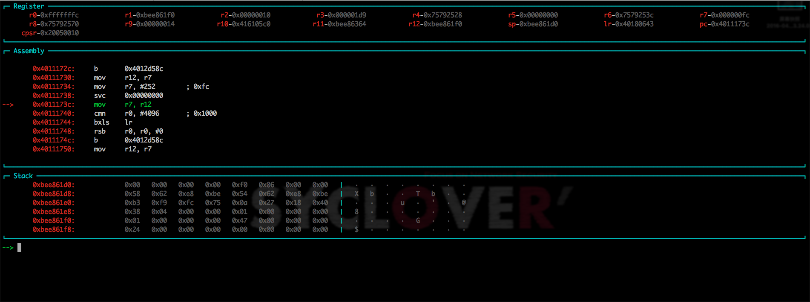

# Strongdb

## What is it?
用于辅助调试android native的gdb UI插件，使调试native程序时有更友好的界面。插件使用python开发，使用了gdb的[python api接口](https://sourceware.org/gdb/onlinedocs/gdb/Python-API.html)实现主要功能。代码写的比较乱，也有很多问题，请大家多提意见。




## Modules
* Register: 调试时用于显示寄存器值。
* Assembly: 调试时显示汇编代码。
* Stack: 调试时显示栈数据。

## Install
```
git clone https://github.com/cx9527/strongdb.git ~/strongdb
echo "source ~/strongdb/strongdb.py" > ~/.gdbinit
```

## JNIEnv
要使用jni函数解析功能，首先要获取JNIEnv的地址，然后使用```set $sgdb_jnienv = address```来设置这个变量。

## Future
* 实现辅助调试用的指令。
* 解析jni函数调用。 (已实现)
* 解析函数参数。